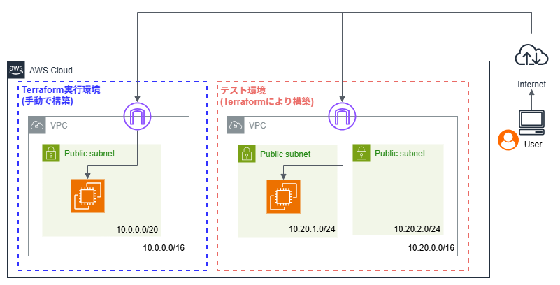

# ハンズオンタイトル
AWS-IaC-hands-on

## 概要
このリポジトリは、Terraformを使用したAWSインフラ構築の学習記録です。  
AWSインフラ構築を手動、Terraform、両方で、VPCの作成～EC2の構築を実施することで、  
インフラ構築の基礎を身につけることを目的としています。  
手動により構築されたTerraform実行サーバでの作業内容をまとめています。
Terraformにより構築しているテストサーバはWebサーバとしての利用を想定して、構築しています。

## 構成図


## 構築するリソース
### Terraform実行サーバ(手動で構築)  
- VPC
  - リージョン：ap-northeast-1(アジアパシフィック（東京）リージョン)
  - 10.0.0.0/16
- サブネット
  - パブリックサブネット
  - 10.0.0.0/20
- セキュリティグループ  
  - インバウンドルール
    - 家のグローバルIPアドレスからのSSHのみ許可
- IAMロール 
  - 名前
    - terraform_Role
  - 許可ポリシー
    - AmazonEC2FullAccess
    - AmazonVPCFullAccess
- EC2インスタンス
  - AMI
    - ID：ami-081a019e7591fd4af
    - AMI名：RHEL-10.1.0_HVM-20260108-x86_64-0-Hourly2-GP3
  - IAMロール
    - terraform_Role

### テストサーバ(Terraformにより構築)
- VPC
  - リージョン：ap-northeast-1(アジアパシフィック（東京）リージョン)
  - 10.20.0.0/16
- サブネット
  - パブリックサブネット
  - 10.20.1.0/24
  - 10.20.2.0/24
- セキュリティグループ  
  - インバウンドルール
    - 家のグローバルIPアドレスからのSSH, HTTP, HTTPSのみ許可
- EC2インスタンス
  - AMI
    - ID：ami-081a019e7591fd4af
    - AMI名：RHEL-10.1.0_HVM-20260108-x86_64-0-Hourly2-GP3


## 使用技術・ツール
- Terraform: v1.14.6

## 使い方
プロジェクトでは、Terraformのバージョン管理ツール `tenv` を使用しています。
### 1：Terraform環境セットアップ
```
# tenvインストール
curl -1sLf 'https://dl.cloudsmith.io/public/tofuutils/tenv/cfg/setup/bash.rpm.sh' | sudo bash
yum install tenv

# インストールできるTerraformのバージョン確認
tenv tf list-remote

# Terraformインストール
tenv tf install 1.14.6

# 使用するTerraformのバージョンを指定
tenv tf use 1.14.6

# 利用中のTerraformのバージョン確認
terraform version

# Terraformディレクトリ作成
mkdir ./terraform

# 実行ディレクトリへ移動し初期化
cd terraform
terraform init

```

### 2：Terraform実行
```
# 実行計画の確認
terraform plan

# リソースの作成
terraform apply

```
## 工夫した点・学習メモ
- Terraformによる環境構築だけではなく、手動によるサーバ構築も行うことで、  
 コードによるインフラ管理の利便性、冪等性を体感した。
- EC2インスタンス上のTerraform実行サーバからTerraformコマンドを実行することで、  
 AWS IAMユーザのアクセスキー管理をしない、より安全な設計にした。
- `terraform fmt`コマンドによりインデント修正を行い、可読性を向上した。


## 参考文献 / 学習リソース
### 書籍
- 中垣 健志 著 『AWSではじめるインフラ構築入門 第2版 安全で堅牢な本番環境のつくり方』 (翔泳社)
  - [Amazon 商品ページ](https://www.amazon.co.jp/dp/4798178004)
### 動画・Web
- [【完全版】Terraform×Ansible超入門！これ1本で学ぶクラウドインフラの自動化](https://www.youtube.com/watch?v=66pCzSV1QHc) (YouTube)